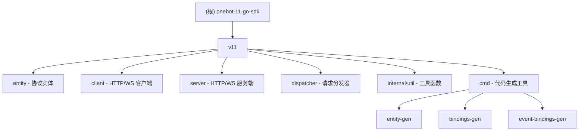

# onebot-11-go-sdk

OneBot 11 协议的 Go 语言 SDK 实现

---

## 变更记录 (Changelog)

### 2026-01-05 17:46:16

- **通信层重构**: 新增 WebSocket 支持 (Client/Server)，引入统一服务器 (UnifiedServer)
- **模块拆分**: 独立 `dispatcher` 模块，支持 Action 请求分发
- **事件系统**: 新增 `EventDispatcher` 和 `event-bindings-gen` 代码生成工具
- **工具库扩展**: 新增泛型 `RadixTree` 实现，用于高效路由匹配
- **依赖更新**: 新增 `gorilla/websocket`、`armon/go-radix`

### 2025-12-21 15:53:08

- **初始化**: 首次生成项目 AI 上下文文档
- **覆盖范围**: 完整扫描了所有核心模块（entity、client、server、internal/util、cmd）
- **模块识别**: 5 个主要功能模块 + 2 个代码生成工具

---

## 项目愿景

onebot-11-go-sdk 旨在为 Go 语言开发者提供完整、类型安全、易用的 OneBot 11 协议实现。项目采用现代化的 Go 开发实践，通过代码生成保证协议实体的一致性，支持 HTTP 和 WebSocket 双协议通信。

**核心价值**：

- **完整的协议支持**：覆盖 OneBot 11 全部消息、事件、API 定义
- **类型安全**：基于代码生成的强类型实体，避免运行时错误
- **多协议通信**：同时支持 HTTP 和 WebSocket (正向/反向) 通信
- **统一服务器**：UnifiedServer 整合 HTTP 和 WebSocket，简化部署
- **可扩展架构**：基于 Dispatcher 的插件式处理器注册机制
- **开发体验优先**：通过代码生成减少样板代码，支持链式调用

---

## 架构总览

```
onebot-11-go-sdk/
├── v11/                          # 主要代码目录
│   ├── entity/                   # OneBot 协议实体定义
│   ├── client/                   # HTTP/WebSocket 客户端实现
│   ├── server/                   # HTTP/WebSocket 服务端实现
│   ├── dispatcher/               # 独立的请求分发器模块
│   ├── internal/util/            # 内部工具函数
│   └── cmd/                      # 代码生成工具
│       ├── entity-gen/           # 实体 Getter/Setter 生成器
│       ├── bindings-gen/         # API 绑定代码生成器
│       └── event-bindings-gen/   # 事件绑定代码生成器
├── .github/workflows/            # CI/CD 配置
└── go.mod                        # Go 模块定义
```

**技术栈**：

- **语言版本**: Go 1.25
- **核心依赖**: mapstructure (v2.4.0), gorilla/websocket (v1.5.3), testify (v1.11.1), yaml.v3, go-radix (v1.0.0)
- **质量保障**: golangci-lint (100+ linters), 单元测试 + 基准测试

---

## 模块结构图



---

## 模块索引

| 模块路径                  | 职责描述                                  | 关键文件                                                           |
| ------------------------- | ----------------------------------------- | ------------------------------------------------------------------ |
| `v11/entity`              | OneBot 11 协议实体定义（消息/事件/API）   | `message.go`, `event.go`, `api.go`, `communication.go`, `*_consts.go` |
| `v11/client`              | HTTP/WebSocket 客户端实现                 | `http_client.go`, `websocket.go`, `http_client_actions.go`         |
| `v11/server`              | HTTP/WebSocket 服务端实现                 | `http_server.go`, `websocket.go`, `unified_server.go`, `event_dispatcher.go` |
| `v11/dispatcher`          | 独立的 Action 请求分发器                  | `dispatcher.go`, `types.go`, `errors.go`                           |
| `v11/internal/util`       | 内部工具函数（JSON 映射、基数树等）       | `util.go`, `radix_tree.go`                                         |
| `v11/cmd/entity-gen`      | 实体 Getter/Setter 代码生成工具           | `main.go`, `generator.go`, `README.md`                             |
| `v11/cmd/bindings-gen`    | API 绑定代码生成工具                      | `main.go`, `models.go`, `config.yaml`                              |
| `v11/cmd/event-bindings-gen` | 事件绑定代码生成工具                   | `main.go`, `models.go`, `config.yaml`                              |

详细模块文档：

- [entity 模块](./v11/entity/CLAUDE.md) - 协议实体与常量定义
- [client 模块](./v11/client/CLAUDE.md) - HTTP/WebSocket 客户端封装
- [server 模块](./v11/server/CLAUDE.md) - HTTP/WebSocket 服务端与分发器
- [internal/util 模块](./v11/internal/util/CLAUDE.md) - 工具函数库
- [entity-gen 工具](./v11/cmd/entity-gen/CLAUDE.md) - Getter/Setter 生成器
- [bindings-gen 工具](./v11/cmd/bindings-gen/CLAUDE.md) - API 绑定生成器

---

## 运行与开发

### 环境要求

- Go 1.25+
- Git

### 快速开始

```bash
# 克隆仓库
git clone https://github.com/q1bksuu/onebot-go-sdk.git
cd onebot-11-go-sdk

# 下载依赖
go mod download

# 运行测试
go test ./...

# 运行基准测试
go test -bench=. -benchmem ./...

# 生成代码（如果修改了实体定义）
go generate ./...
```

### 开发工作流

1. **修改协议实体**：编辑 `v11/entity/*.go` 文件
2. **重新生成代码**：运行 `go generate ./v11/entity`
3. **更新测试**：在 `*_test.go` 中添加测试用例
4. **代码检查**：`golangci-lint run` (本地) 或提交 PR 触发 CI

### 代码生成工具使用

```bash
# 生成实体 Getter/Setter
cd v11/entity
go run ../cmd/entity-gen/main.go -file=base.go -type=StatusMeta

# 生成 API 绑定
cd v11/cmd/bindings-gen
go run . -config=config.yaml -http-client-actions-output=../../client/http_client_actions.go

# 生成事件绑定
cd v11/cmd/event-bindings-gen
go run . -config=config.yaml
```

---

## 测试策略

### 测试覆盖

- **单元测试**：所有核心模块都有对应的 `_test.go` 文件
- **基准测试**：关键路径（如 JSON 解析、基数树操作）提供性能基准
- **测试运行**：GitHub Actions 在 ubuntu/macos/windows 三平台运行

### 测试分布

| 模块              | 测试文件                                    | 测试场景                                      |
| ----------------- | ------------------------------------------- | --------------------------------------------- |
| `entity`          | `base_test.go`, `api_test.go`               | 自定义 JSON 反序列化，原始字段保留            |
| `client`          | `http_client_test.go`, `websocket_test.go`  | HTTP/WS 客户端请求构建、错误处理、响应解析    |
| `server`          | `http_server_test.go`, `websocket_test.go`, `unified_server_test.go` | 路由、鉴权、WebSocket、统一服务器 |
| `dispatcher`      | `dispatcher_test.go`                        | Action 请求分发、处理器注册                   |
| `internal/util`   | `util_test.go`, `radix_tree_test.go`        | JSON 映射工具、基数树操作                     |

### CI/CD 配置

- **代码检查**: `.github/workflows/golangci-lint.yml` (100+ linters)
- **测试运行**: `.github/workflows/go-tests.yml` (跨平台、覆盖率)

---

## 编码规范

### 质量标准

项目采用 **极其严格** 的代码检查规则（`.golangci.yml`），启用了 100+ linters，包括：

- **安全性**: gosec, errcheck, err113
- **性能**: prealloc, perfsprint
- **可读性**: varnamelen, funlen, gocognit
- **一致性**: tagliatelle (强制 JSON 字段 snake_case)
- **错误处理**: wrapcheck, errorlint, errname
- **单元测试**: 使用 testify/assert, testify/require 校验, paralleltest 启用

### 关键规则

- **函数长度**: 不超过 80 行 (`funlen.lines: 80`)
- **变量命名**: 最短 3 字符，允许例外 (`i`, `j`, `id`, `ok` 等)
- **JSON 标签**: 必须使用 `snake_case` 风格
- **依赖管理**: 禁用 `github.com/pkg/errors`，使用标准库 `errors`

### Go 1.25 特性

- 使用了 `copyloopvar` linter (Go 1.22+ 循环变量特性)
- 模块版本要求 `go 1.25`

---

## AI 使用指引

### 快速导航

- **查看协议定义**: 参考 `v11/entity/CLAUDE.md`
- **实现 HTTP 客户端**: 参考 `v11/client/CLAUDE.md`
- **实现 WebSocket 客户端**: 参考 `v11/client/websocket.go`
- **实现 HTTP/WS 服务端**: 参考 `v11/server/CLAUDE.md`
- **使用统一服务器**: 查看 `v11/server/unified_server.go`
- **添加新 API**:
  1. 在 `v11/entity/api.go` 添加 Request/Response 结构体
  2. 在 `v11/cmd/bindings-gen/config.yaml` 添加配置
  3. 运行 `go generate` 重新生成绑定代码

### 常见任务

**Q: 如何添加新的 OneBot API？**

1. 在 `v11/entity/api.go` 定义 `XxxRequest` 和 `XxxResponse`
2. 编辑 `v11/cmd/bindings-gen/config.yaml`，在对应 group 添加 action
3. 运行 `go generate ./v11/client` 和 `go generate ./v11/server`
4. 生成的代码会自动出现在 `http_client_actions.go` 和 `http_server_actions_register.go`

**Q: 如何使用统一服务器 (UnifiedServer)？**

`UnifiedServer` 整合了 HTTP 和 WebSocket 服务端，支持同时处理两种协议：

```go
config := server.UnifiedConfig{
    // 配置 HTTP 和 WebSocket 参数
}
srv := server.NewUnifiedServer(config)
srv.Start()
```

**Q: 如何处理 OneBot 协议的动态字段？**

参考 `StatusMeta` 和 `GetVersionInfoResponse` 的实现：

- 使用 `origin map[string]any` 字段保存所有原始数据
- 实现自定义 `UnmarshalJSON` 方法调用 `util.JsonUnmarshalToMapAndStruct`
- 提供 `GetOrigin(key)` 和 `SetOrigin(key, value)` 方法访问扩展字段

**Q: 为什么有些字段有 Getter/Setter？**

带有 `//go:generate go run ../cmd/entity-gen` 注释的文件会自动生成 Getter/Setter，这样做的好处：

- **空指针安全**: Getter 始终返回非 nil 值
- **链式调用**: `user.SetID(1).SetName("alice")`
- **类型转换**: 指针字段的 Setter 接受值类型参数

**Q: 如何扩展事件处理？**

使用 `EventDispatcher` 注册事件处理器：

```go
dispatcher := server.NewEventDispatcher()
dispatcher.Register("message.private", handlePrivateMessage)
dispatcher.HandleEvent(eventData)
```

**Q: Dispatcher 模块有什么作用？**

`v11/dispatcher` 是独立的 Action 请求分发器模块：

```go
d := dispatcher.NewDispatcher()
d.Register("send_private_msg", handler)
d.HandleActionRequest(ctx, action, params)
```

### 项目特色

- **协议与实现分离**: `entity` 包只包含数据结构，不包含业务逻辑
- **代码生成驱动**: 大量样板代码由工具生成，保证一致性
- **多协议支持**: HTTP + WebSocket (正向/反向) 全覆盖
- **统一服务器**: UnifiedServer 简化多协议部署
- **测试完备**: 单元测试 + 性能基准测试
- **文档完整**: 每个代码生成工具都有详细的 README

---

## 相关资源

- **OneBot 11 标准**: https://github.com/botuniverse/onebot-11
- **GitHub 仓库**: https://github.com/q1bksuu/onebot-go-sdk
- **Go 官方文档**: https://go.dev/doc/

---

*文档更新时间: 2026-01-05 17:46:16*
*文档版本: v1.1.0 (通信层重构)*
